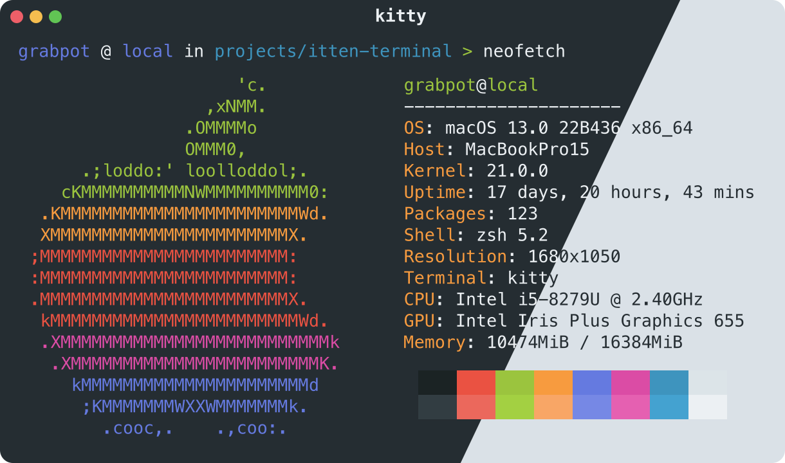

# Itten Colour Theme
A sixteen colour theme inspired by the *Farbkreis* color wheel created by 20th century Swiss artist Johannes Itten [1], developed and designed for use with 4-bit ANSI terminals.

Colour themes are also available for [Vim](https://github.com/grabpot/itten-vim) and [VS Code](https://github.com/grabpot/itten-vscode).



## Installation
Colour theme configuration files are available for several popular terminal emulators, including Kitty and Alacritty. To install the theme, copy the files to the terminal configuration directory and follow the terminal-specific instructions to enable the theme. 

For example, when using Kitty, copy the files to `~/.config/kitty/themes`, and run `kitty +kitten themes` or add the following lines to your Kitty configuration file at `~/.config/kitty/kitty.conf`:

```
# BEGIN_KITTY_THEME
include ./themes/itten-dark.conf
# END_KITTY_THEME
```
## Colours
The standard sixteen ANSI terminal colors, in RGB and Hexadecimal format, along with the Select Graphic Rendition (SGR) parameter to set the appropriate Foreground (FG) and Background (BG) colour, are given in the table below.

| FG | BG  | Color                                        | RGB           | Hex     |
|----|-----|----------------------------------------------|---------------|---------|
| 30 |  40 | $\color{#1b2324}{\textsf{▨}}$ Black          |  27,  35,  36 | #1b2324 |
| 31 |  41 | $\color{#ea5242}{\textsf{▨}}$ Red            | 234,  82,  66 | #ea5242 |
| 32 |  42 | $\color{#9bc43e}{\textsf{▨}}$ Green          | 155, 196,  62 | #9bc43e |
| 33 |  43 | $\color{#f79b3f}{\textsf{▨}}$ Yellow         | 247, 155,  63 | #f79b3f |
| 34 |  44 | $\color{#657ae0}{\textsf{▨}}$ Blue           | 101, 122, 224 | #657ae0 |
| 35 |  45 | $\color{#db4ca5}{\textsf{▨}}$ Magenta        | 219,  76, 165 | #db4ca5 |
| 36 |  46 | $\color{#3e94be}{\textsf{▨}}$ Cyan           |  62, 148, 190 | #3e94be |
| 37 |  47 | $\color{#dce4e8}{\textsf{▨}}$ White          | 220, 228, 232 | #dce4e8 |
| 90 | 100 | $\color{#323d42}{\textsf{▨}}$ Bright Black   |  50,  61,  66 | #323d42 |
| 91 | 101 | $\color{#eb685c}{\textsf{▨}}$ Bright Red     | 235, 104,  92 | #eb685c |
| 92 | 102 | $\color{#a3d042}{\textsf{▨}}$ Bright Green   | 163, 208,  66 | #a3d042 |
| 93 | 103 | $\color{#f8a666}{\textsf{▨}}$ Bright Yellow  | 248, 166, 102 | #f8a666 |
| 94 | 104 | $\color{#7688e5}{\textsf{▨}}$ Bright Blue    | 118, 136, 229 | #7688e5 |
| 95 | 105 | $\color{#e560b1}{\textsf{▨}}$ Bright Magenta | 229,  96, 177 | #e560b1 |
| 96 | 106 | $\color{#44a2d0}{\textsf{▨}}$ Bright Cyan    |  68, 162, 208 | #44a2d0 |
| 97 | 107 | $\color{#ecf0f3}{\textsf{▨}}$ Bright White   | 236, 240, 243 | #ecf0f3 |

In addition to the standard ANSI colours, several additional common terminal colours are also defined in the table below.

| Color                                            | RGB           | Hex     |
|--------------------------------------------------|---------------|---------|
| $\color{#ecf0f3}{\textsf{▨}}$ Dark Foreground    | 236, 240, 243 | #ecf0f3 |
| $\color{#252d32}{\textsf{▨}}$ Dark Background    |  37,  45,  50 | #252d32 |
| $\color{#ecf0f3}{\textsf{▨}}$ Dark Cursor        | 236, 240, 243 | #ecf0f3 |
| $\color{#333c45}{\textsf{▨}}$ Dark Selection     |  51,  60,  69 | #333c45 |
| $\color{#252d32}{\textsf{▨}}$ Light Foreground   |  37,  45,  50 | #252d32 |
| $\color{#dae1e7}{\textsf{▨}}$ Light Background   | 218, 225, 231 | #dae1e7 |
| $\color{#333c45}{\textsf{▨}}$ Light Cursor       |  51,  60,  69 | #333c45 |
| $\color{#cad6de}{\textsf{▨}}$ Light Selection    | 202, 214, 222 | #cad6de |

## References

1. Itten, Johannes (1973). *The Art of Color: the subjective experience and objective rationale of color.* New York: Van Nostrand Reinhold. ISBN 0-442-24037-6.

## Licence
This work is licensed under the GNU General Public License, Version 3.